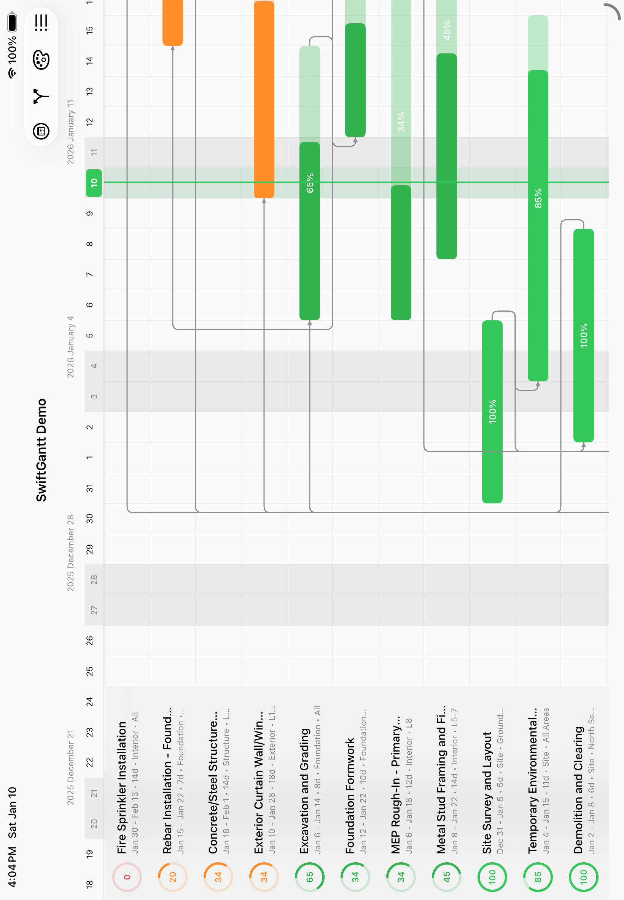

# SwiftGantt

A high-performance Gantt chart component for SwiftUI with support for task dependencies, progress tracking, and Core Data integration.



## Features

- Virtualized row rendering for smooth scrolling with thousands of tasks
- Task dependencies with smart routing (avoids overlapping task bars)
- Progress tracking with visual indicators
- Customizable appearance (colors, sizes, grid options)
- Today marker with auto-scroll
- Weekend highlighting
- Sticky task labels column
- Directional scroll locking
- Support for any `Identifiable` type (UUID, Int64, etc.)
- Core Data compatible

## Requirements

- iOS 16.0+
- macOS 13.0+
- Swift 5.9+

## Installation

### Swift Package Manager

Add SwiftGantt to your project via Xcode:

1. File > Add Package Dependencies
2. Enter the repository URL
3. Select the version

Or add it to your `Package.swift`:

```swift
dependencies: [
    .package(url: "https://github.com/your-repo/SwiftGantt.git", from: "1.0.0")
]
```

## Usage

### Basic Usage

1. Create a task type conforming to `GanttTask`:

```swift
import SwiftGantt

struct MyTask: GanttTask {
    let id: UUID
    let title: String
    let subtitle: String?
    let startDate: Date
    let endDate: Date
    var progress: Double
    var color: Color
}
```

2. Display the Gantt chart:

```swift
struct ContentView: View {
    let tasks: [MyTask] = [...]
    let dateRange = Date()...Date().addingTimeInterval(86400 * 30)

    var body: some View {
        GanttChart(
            tasks: tasks,
            dateRange: dateRange
        ) { task in
            print("Tapped: \(task.title)")
        }
    }
}
```

### GanttTask Protocol

Your task type must conform to `GanttTask`:

```swift
public protocol GanttTask: Identifiable {
    var title: String { get }
    var subtitle: String? { get }      // Optional, defaults to nil
    var startDate: Date { get }
    var endDate: Date { get }
    var progress: Double { get }       // 0.0 to 1.0, defaults to 0.0
    var color: Color { get }           // Defaults to .blue
}
```

### Task Dependencies

Add dependency lines between tasks:

```swift
let dependencies: [GanttDependency<UUID>] = [
    GanttDependency(fromId: task1.id, toId: task2.id, type: .endToStart),
    GanttDependency(fromId: task2.id, toId: task3.id, type: .endToStart)
]

GanttChart(
    tasks: tasks,
    dependencies: dependencies,
    dateRange: dateRange
)
```

Dependency types:
- `.endToStart` - Task B starts after Task A ends (most common)
- `.startToStart` - Task B starts when Task A starts
- `.endToEnd` - Task B ends when Task A ends
- `.startToEnd` - Task B ends when Task A starts

### Core Data Integration

SwiftGantt supports Core Data entities with any `Hashable` ID type (including `Int64`):

```swift
// Your Core Data entity
@objc(CDTask)
public class CDTask: NSManagedObject, Identifiable {
    @NSManaged public var id: Int64
    @NSManaged public var title_: String?
    @NSManaged public var startDate_: Date?
    @NSManaged public var endDate_: Date?
    @NSManaged public var progress: Double
    @NSManaged public var colorHex: String?
}

// Conform to GanttTask
extension CDTask: GanttTask {
    public var title: String { title_ ?? "Untitled" }
    public var subtitle: String? { nil }
    public var startDate: Date { startDate_ ?? Date() }
    public var endDate: Date { endDate_ ?? Date() }
    public var color: Color { /* parse colorHex */ }
}

// Use with Int64-based dependencies
let dependencies: [GanttDependency<Int64>] = [
    GanttDependency(fromId: 1, toId: 2, type: .endToStart)
]

GanttChart(
    tasks: coreDataTasks,
    dependencies: dependencies,
    dateRange: dateRange
)
```

### Configuration

Customize the chart appearance:

```swift
let config = GanttChartConfiguration(
    rowHeight: 60,
    labelColumnWidth: 280,
    dayColumnWidth: 40,
    gridColor: .gray.opacity(0.2),
    weekendColor: .gray.opacity(0.15),
    todayMarkerColor: .green,
    showTodayMarker: true,
    showHorizontalGrid: true,
    showVerticalGrid: true,
    showWeekendHighlight: true,
    barCornerRadius: 6,
    barHeightRatio: 0.45,
    headerHeight: 50,
    showProgressLabel: true,
    virtualizationBuffer: 20,
    showDependencies: true,
    dependencyLineColor: .gray,
    dependencyLineWidth: 1.5
)

GanttChart(
    tasks: tasks,
    dateRange: dateRange,
    configuration: config
)
```

## Demo App

The included demo app (`SwiftGanttDemo`) showcases:
- Multiple dataset sizes (2 to 30,000 tasks)
- Task dependencies with visual routing
- Core Data integration example
- Sort by color feature
- Dependency toggle

## License

MIT License
